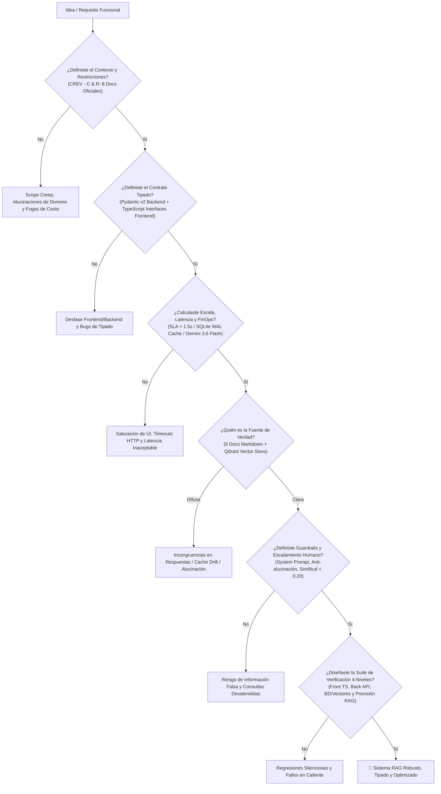

# Documento de Especificación de Requisitos de Software (SRS)
## Sistema Asistente Virtual RAG — Academia Idiomas Colombia
**Versión del Documento:** 2.0.0 (Optimizada)  
**Fecha de Emisión:** 7 de Septiembre de 2026  
**Estándar de Referencia:** IEEE 830 / ISO/IEC/IEEE 29148  
**Organización:** Academia Idiomas Colombia / Riwi  
**Estado:** Aprobado para Implementación  

---

## Control de Versiones y Gestión de Cambios (ISO/IEC/IEEE 29148)

| Versión | Fecha | Autor | Descripción del Cambio / Justificación | Estado |
| :---: | :---: | :--- | :--- | :---: |
| **1.0.0** | 04/09/2026 | Equipo de Ingeniería Riwi | Línea base formal inicial con RAG síncrono y caché básica. | Superada |
| **2.0.0** | 07/09/2026 | Arquitectura & AI Team | **Rediseño Integral v2.0_opt:** Adopción del marco CREV, frontend 100% TypeScript con contratos tipados, backend Python asíncrono con FastAPI, base vectorial en Qdrant (modo local embebido con métrica Coseno), LLM Gemini 3.6 Flash, umbral de escalamiento humano en $< 0.20$, 8 documentos temáticos y suite de pruebas de 4 capas. | **Aprobado** |

---

## 1. Introducción y Marco CREV

### 1.1 Propósito
Este documento define de manera formal y verificable los requisitos funcionales, no funcionales y de arquitectura del **Asistente Virtual RAG v2.0_opt** de la Academia Idiomas Colombia. Sirve como fuente única de verdad técnica para el desarrollo y aseguramiento de calidad (QA).

### 1.2 Marco Metodológico CREV

```
+---------------------------------------------------------------------------------------------------+
|                                      MARCO CREV DEL SISTEMA                                       |
+-------------------+-------------------------------------------------------------------------------+
| C - Contexto      | Academia de idiomas colombiana saturada con consultas diarias sobre horarios, |
|                   | precios, niveles, inscripciones, certificaciones y modalidades. Asistente RAG |
|                   | ágil, empático y 100% fundamentado en los 8 documentos de negocio.           |
+-------------------+-------------------------------------------------------------------------------+
| R - Restricciones | 1. Cero alucinaciones: No inventar información ausente en los 8 documentos.   |
|                   | 2. Out-of-Scope (temas ajenos): Responde el LLM (escalar_humano: false).       |
|                   | 3. Contexto de Academia: Escalamiento a humano si la información es            |
|                   |    insuficiente o similitud < 0.20 (escalar_humano: true).                     |
|                   | 4. FinOps: Latencia <1.5s mediante caché determinista SQLite WAL sub-2ms.     |
|                   | 5. Modelo LLM exclusivo: Google Gemini 3.6 Flash con temperatura = 0.2.       |
|                   | 5. Seguridad: Credenciales y API Keys estrictamente en variables de entorno.  |
+-------------------+-------------------------------------------------------------------------------+
| E - Esquema       | 1. Contratos bidireccionales tipados: Pydantic v2 (Back) <-> TypeScript (Front)|
|                   | 2. Qdrant local persistente con colección de vectores de 768 dimensiones.     |
|                   | 3. Esquema de telemetría: latencias, tokens consumidos, tasa de escalamiento. |
+-------------------+-------------------------------------------------------------------------------+
| V - Verificación  | Pirámide de pruebas de 4 capas:                                               |
|                   | - Capa 1 (Frontend): Tipado estricto TypeScript y manejo de respuestas.       |
|                   | - Capa 2 (Backend): API REST FastAPI, validación de payloads y error handling.|
|                   | - Capa 3 (BD/Vectores): Ingestión de 8 documentos y búsqueda en Qdrant.       |
|                   | - Capa 4 (RAG Precision): Detección de out-of-scope y umbral de escalado 0.20.|
+-------------------+-------------------------------------------------------------------------------+
```

---

## 2. Diagrama de Decisiones Técnicas Aprobado



---

## 3. Catálogo de las 8 Fuentes de Verdad (Documentos Oficiales)

1. **`01_horarios_y_modalidades.md`**: Modalidad Presencial (Sedes Medellín y Bogotá), Virtual en vivo, e Híbrida. Jornadas mañana (6:00-8:00 AM, 8:00-10:00 AM), tarde (2:00-4:00 PM), noche (6:30-8:30 PM), y sabatinos intensivos (8:00 AM - 1:00 PM).
2. **`02_precios_y_metodos_pago.md`**: Precios por nivel en COP ($850.000 COP) y USD ($220 USD). Descuento por pago anual anticipado (15%). Financiación en 3 cuotas sin interés con entidades aliadas. Pasarelas PSE, tarjetas y transferencias bancarias. No transacciones financieras dentro del chat.
3. **`03_niveles_y_metodologia.md`**: Estructura según MCER (A1, A2, B1, B2, C1). 60 horas académicas presenciales/virtuales + 20 horas de laboratorio interactivo por submódulo. Metodología basada en tareas (Task-Based Learning) e inmersión activa.
4. **`04_proceso_inscripcion_y_requisitos.md`**: Requisitos: documento de identidad válido, edad mínima 14 años (programa adultos), formulario de matrícula y comprobante de pago. Fechas de inicio los primeros martes de cada mes.
5. **`05_certificaciones_y_examenes.md`**: Cursos de preparación oficial para IELTS Academic/General, TOEFL iBT, y Cambridge B2 First / C1 Advanced. Emisión de Certificado de Aptitud Ocupacional avalado por la Secretaría de Educación.
6. **`06_politicas_cancelacion_y_reembolsos.md`**: Derecho de retracto hasta 5 días hábiles antes del inicio (100% reembolso menos gastos administrativos del 5%). Congelamiento de semestre permitido por fuerza mayor acreditada por máximo 6 meses.
7. **`07_prueba_clasificacion_placement_test.md`**: Test de nivelación diagnóstico 100% virtual (gramática, comprensión auditiva y entrevista oral de 15 min). Costo: $45.000 COP, deducible de la matrícula si el estudiante se inscribe.
8. **`08_canales_soporte_y_escalamiento_humano.md`**: Criterios de escalamiento humano: quejas, casos médicos/legales, convenios empresariales personalizados y preguntas fuera del catálogo académico. Contacto humano: WhatsApp +57 301 732 5327, correo `admisiones@idiomascolombia.edu.co`, lunes a viernes 7:00 AM - 7:00 PM y sábados 8:00 AM - 2:00 PM.

---

## 4. Requisitos del Sistema

### 4.1 Requisitos Funcionales (RF)
- **RF-01: Ingestión e Indexación en Qdrant:** Cargar los 8 documentos Markdown, generar chunks semánticos (600 caracteres con overlap de 100 caracteres) y almacenarlos en **Qdrant** indexando vectores densos de 768 dimensiones generados con `text-embedding-004`.
- **RF-02: Consulta RAG Asíncrona:** Endpoint `POST /api/chat` que reciba `{ "pregunta": string, "historial"?: list }` y retorne `{ "respuesta": string, "fuentes": list, "confianza": float, "escalar_humano": bool, "origen": string, "tiempo_ms": float }`.
- **RF-03: Enrutamiento Inteligente Multi-Tier:**
  - *Tier 0 (Caché WAL):* Consulta repetida responde en $< 5\text{ ms}$ desde SQLite WAL con `origen: "cache"`.
  - *Tier 1 (Out-of-Scope LLM):* Si la consulta no tiene que ver con la academia (temas externos), responde directamente Gemini Flash aclarando su rol (`escalar_humano: false`, `origen: "out_of_scope_llm"`).
  - *Tier 2 (Scope Alto en Qdrant $\ge 0.40$):* Inferencia local con **Ollama** (`llama3:8b`, \$0 tokens, alta fidelidad semántica en chunks oficiales, `origen: "rag_ollama_local"`, `escalar_humano: false`).
  - *Tier 3 (Scope Medio $0.20 \le \text{Score} < 0.40$):* Inferencia cloud con **Google Gemini 3.6 Flash** para razonamiento avanzado (`origen: "rag_gemini_flash"`, `escalar_humano: false`).
  - *Tier 4 (Escalamiento a Asesor Humano):* Si la consulta pertenece al contexto de la academia pero la similitud es $< 0.20$ o los documentos no contienen información suficiente, activa `escalar_humano: true` (`origen: "rag_qdrant"`) con datos de contacto directo.
- **RF-04: Métricas y Telemetría FinOps:** Endpoint `GET /api/metrics` con consultas atendidas, tasa de cache hits, tasa de escalamiento a humano y latencia promedio.

### 4.2 Requisitos No Funcionales (RNF)
- **RNF-01 (Latencia):** Respuestas de caché $< 5\text{ ms}$; respuestas completas RAG con Gemini Flash $< 1.8\text{ s}$.
- **RNF-02 (Seguridad):** API Key de Gemini leída exclusivamente desde `.env` (`GEMINI_API_KEY`). Cero credenciales hardcodeadas.
- **RNF-03 (Tipado Estricto):** Coherencia 100% entre modelos Pydantic v2 y TypeScript interfaces.
- **RNF-04 (Autocontenido):** Qdrant (modo local embebido) y SQLite residen localmente en `./data/`, sin dependencias de contenedores pesados ni bases de datos en la nube.
